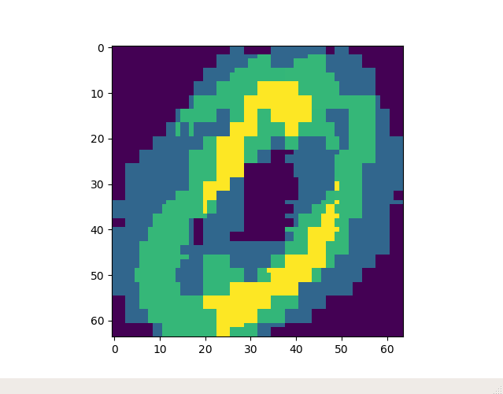

## PseudoNeural

### Purpose

Create a program to recognize written numbers (actually it can be used to
other characters too) before knowing how to make a neural network.

### What it does

It prints out the text from an black and white image, but it has to be trained
first.

### How to use

First get the black and white file you want to extract the text and get other
black and white text images for training. Get to the folder
that contains the executable `charRecog` and execute
`./charRecog -l <train image>`. You'll be poked with matplotlib's windows asking
you to classify the characters. Answer them and make this for the other train
files too. Once you've finished, you can extract the text of an image using
`./charRecog <image>`. More information can be found if you run
`./charRecog --help`.

