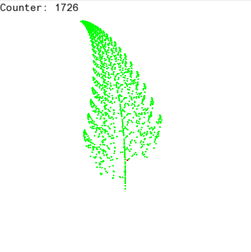
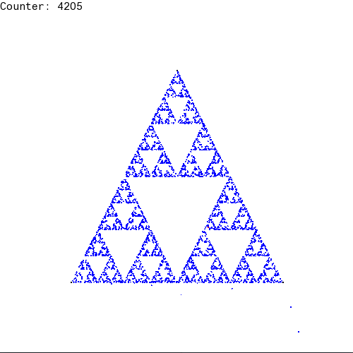

## RandomFractals

### What it does

This program generates Sierpinski's triangle and Barnsley's fern fractals using
random moving dots.

### How to use

Generate an executable using `make exec` command, execute it and follow the
instructions.

 
