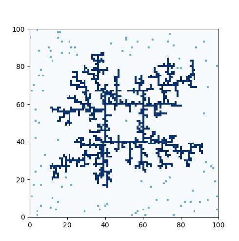

## RandomWalk

### Purpose

Reproduce a stochastic chaotic system ([diffusion-limited aggregation](https://en.wikipedia.org/wiki/Diffusion-limited_aggregation)) seen at a
[MAC0209 (Modeling and simulating)](https://uspdigital.usp.br/jupiterweb/obterDisciplina?sgldis=MAC0209)
class.

### What it does

Generates a random-branching structure using random walking dots.

### How to use

Just execute `python random-walk.py <initial seed file> <number of walkers>`.
You can use the file in.txt as a initial seed file and start it with 100 walkers.

